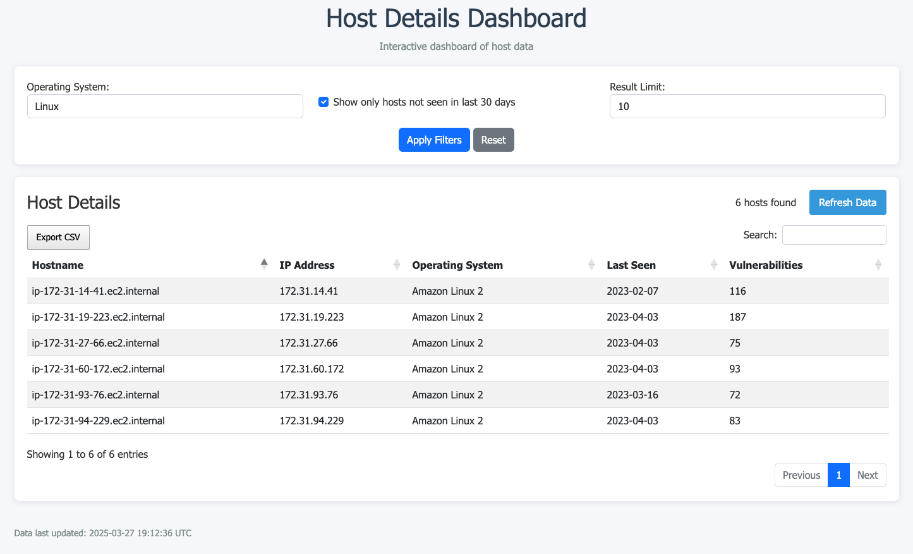
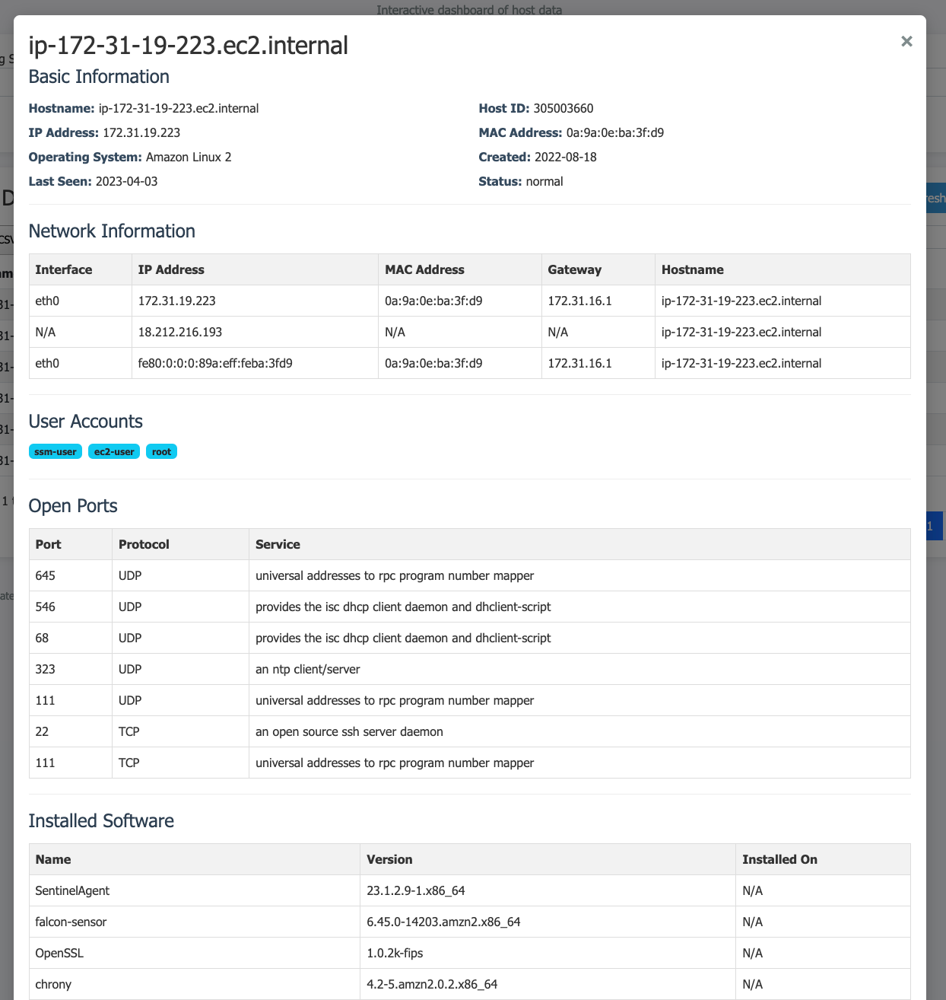

# Silk Exercise API

A FastAPI application for managing host asset data with MongoDB.

## Features

- Fully async implementation with FastAPI
- MongoDB integration with Motor (async MongoDB driver)
- Docker Compose setup for easy development and deployment
- Pydantic v2 for data validation and serialization

## Getting Started

### Prerequisites

- Docker and Docker Compose

### Running the Application

1. Clone this repository
2. Create a `.env` file with MongoDB credentials (see `.env.example`)
3. Run with Docker Compose:

```bash
docker compose build
docker compose up
```

4. API URL at http://localhost:8000
5. API documentation is available at http://localhost:8000/docs
6. Health check available at http://localhost:8000/health

## Project Structure

```
.
├── main-application/
│   ├── api/                     # API endpoints
│   │   ├── api_v1/              # API version 1
│   │   │   ├── hosts/           # Hosts API endpoints
│   │   │   └── __init__.py
│   │   └── __init__.py
│   ├── core/                    # Core functionality
│   │   ├── api_client.py        # API request class
│   │   ├── celery_app.py        # Celery Tasks configuration file
│   │   ├── config.py            # Configuration/Settings file
│   │   ├── database.py          # MongoDB connection
│   │   ├── scripts.py           # Core scripts
│   │   ├── tasks.py             # Celery Tasks file
│   │   └── __init__.py
│   ├── main.py                  # FastAPI application entry point
│   ├── Dockerfile               # Docker configuration
│   └── requirements.txt         # Python dependencies
├── .env                         # Environment variables
├── docker-compose.yml           # Docker Compose configuration
└── README.md                    # This file
```

## API Endpoints

### Instance API (prefix: `/api/v1/instances`)

- `GET /api/v1/hosts/` - Get all host assets (filtration/pagination)
- `GET /api/v1/hosts/sync/` - Start process of hosts population

### Health Check

- `GET /health` - Check API and database connection status

### Hosts Dashboard

- `GET /` - Preview extracted and merged data

## Screenshots

### Dashboard Overview


### Host Information


